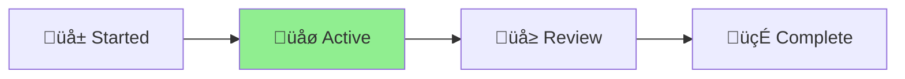

# CLAUDE.md

This file provides guidance to Claude Code (claude.ai/code) when working with this project.

<!-- AICHAKU:START -->
<!-- AICHAKU:METHODOLOGY:START -->
## 🎯 MANDATORY: Aichaku Integration Rules

YOU ARE REQUIRED TO FOLLOW THESE RULES WITHOUT EXCEPTION:

### 1. Discussion-First Document Creation

**Phase 1: DISCUSSION MODE (Default when methodology keywords detected)**
✅ Acknowledge the methodology context: "🪴 Aichaku: I see you're thinking about [topic]"
✅ Ask clarifying questions to understand the goal
✅ Help shape and refine the idea
❌ DO NOT create any project folders yet
❌ DO NOT create any documents yet

**Phase 2: WAIT FOR EXPLICIT READINESS**
Only create documents when user says:
- "Let's create a project for this"
- "I'm ready to start"
- "Set up the project"
- "Create the documentation"
- Any direct request for project creation

**Phase 3: CREATE NAMED PROJECT (After user signals readiness)**
✅ Confirm name: "🪴 Aichaku: Based on our discussion, creating project: [descriptive-name]"
✅ Create ALL documents in: `.claude/output/active-YYYY-MM-DD-{descriptive-name}/`
✅ Create STATUS.md FIRST
✅ Create methodology-specific documents
✅ Read guides from `~/.claude/methodologies/`

**YOU MUST NEVER:**
❌ Create documents in the project root directory
❌ Create documents in .claude/user/ (that's for customizations)
❌ Ask where to put files (always use .claude/output/)
❌ Create folders before user is ready to formalize

### 2. CRITICAL: DISCUSSION FIRST, THEN CREATE WITHOUT ASKING

**During Discussion Phase:**
✅ DO say: "🪴 Aichaku: I understand you're exploring [topic]. Let me help you think through this..."
✅ DO say: "What specific challenges are you looking to address?"
❌ NEVER say: "Would you like me to create documents for this?"

**Once User Signals Readiness:**
❌ NEVER say: "Would you like me to..."
❌ NEVER say: "Shall I create..."
❌ NEVER say: "Should I go ahead and..."
✅ IMMEDIATELY say: "🪴 Aichaku: Creating project: [descriptive-name]"
✅ IMMEDIATELY say: "Setting up Shape Up documentation..."
✅ IMMEDIATELY say: "Generating sprint planning templates..."

**THE RULE:** Discuss and refine FIRST. Once user signals readiness, CREATE IMMEDIATELY without asking. This provides thoughtful structure while respecting user autonomy.

### 3. Methodology Detection & Discussion

When you hear these keywords, ENTER DISCUSSION MODE:

**Planning Keywords** → Will create in `.claude/output/active-*/` (when ready):
- "shape"/"pitch" → Discuss Shape Up approach → Later: pitch.md
- "sprint"/"scrum" → Discuss Scrum planning → Later: sprint-planning.md
- "kanban"/"board" → Discuss Kanban flow → Later: kanban-board.md
- "mvp"/"lean" → Discuss Lean experiments → Later: experiment-plan.md

**Discussion Mode Actions:**
1. Acknowledge: "🪴 Aichaku: I see you're interested in [methodology]"
2. Read the appropriate guide SILENTLY:
   - `~/.claude/methodologies/[methodology]/[METHODOLOGY]-AICHAKU-GUIDE.md`
   - `~/.claude/methodologies/core/[MODE].md`
3. Ask clarifying questions based on the methodology
4. Help refine the approach
5. WAIT for explicit "create project" signal

### 4. Visual Identity & Progress Indicators

**MANDATORY Visual Identity:**
✅ ALWAYS prefix Aichaku messages with: 🪴 Aichaku:
✅ Use growth phase indicators: 🌱 (new) → 🌿 (active) → 🌳 (mature) → 🍃 (complete)
✅ Show current phase in status updates with **bold** text and arrow: [Planning] → [**Executing**] → [Complete]
                                                                                    ▲

**Example Status Display:**
```
🪴 Aichaku: Shape Up Progress
[Shaping] → [**Betting**] → [Building] → [Cool-down]
              ▲
Week 2/6 ████████░░░░░░░░░░░░ 33% 🌿
```

**Methodology Icons:**
- Shape Up: Use 🎯 for betting, 🔨 for building
- Scrum: Use 🏃 for sprints, 📋 for backlog
- Kanban: Use 📍 for cards, 🌊 for flow
- Lean: Use 🧪 for experiments, 📊 for metrics

**NEVER:**
❌ Use garden metaphors in text (no "planting", "growing", "harvesting")
❌ Mix visual indicators (keep consistent within a project)
❌ Overuse emojis (maximum one per concept)

### 5. Mermaid Diagram Integration

**MANDATORY Diagram Creation:**
✅ Include Mermaid diagrams in EVERY project documentation
✅ Add methodology-specific workflow diagrams
✅ Use diagrams to visualize project status

**Required Diagrams by Document:**

**In STATUS.md:**


**In Shape Up pitch.md:**


**In Scrum sprint-planning.md:**


**NEVER:**
❌ Create diagrams without labels
❌ Use complex diagrams when simple ones work
❌ Forget to update diagrams with status changes

### 6. Project Lifecycle Management

**Starting Work:**
1. ⚠️ **CHECK TODAY'S DATE**: Look for "Today's date:" in the environment info
2. Create: `.claude/output/active-YYYY-MM-DD-{descriptive-name}/`
   - YYYY-MM-DD must be TODAY'S actual date from environment
   - Common mistake: Using 01 instead of current month
   - Example if today is 2025-07-10: `active-2025-07-10-project-name/`
3. Create STATUS.md immediately (with status diagram)
4. Read appropriate methodology guides
5. Create planning documents (with workflow diagrams)
6. WAIT for human approval before coding

**During Work:**
- Update STATUS.md regularly (including diagram state)
- Create supporting documents freely
- Start responses with: "🪴 Aichaku: Currently in [mode] working on [task]"

**Completing Work:**
1. Create YYYY-MM-DD-{Project-Name}-CHANGE-LOG.md summarizing all changes
   - ⚠️ Use TODAY'S date from environment info (not example dates!)
   - Example format: 2025-07-10-Fix-Security-Tests-CHANGE-LOG.md
   - Example format: 2025-07-10-Update-Authentication-CHANGE-LOG.md
   - NEVER just "CHANGE-LOG.md" - always include TODAY'S date and descriptive project name
2. Update final diagram states
3. Rename folder: active-* → done-*
4. Ask: "Work appears complete. Shall I commit and push?"
5. Use conventional commits: feat:/fix:/docs:/refactor:

### 7. Git Automation

When work is confirmed complete:
```bash
git add .claude/output/[current-project]/
git commit -m "[type]: [description]

- [what was done]
- [key changes]"
git push origin [current-branch]
```

### 8. Error Recovery

If you accidentally create a file in the wrong location:
1. Move it immediately: `mv [file] .claude/output/active-*/`
2. Update STATUS.md noting the correction
3. Continue without asking

REMEMBER: This is AUTOMATIC behavior. Users expect documents to appear in the right place without asking.

Methodologies: Shape Up, Scrum, Kanban, Lean, XP, Scrumban
Learn more: https://github.com/RickCogley/aichaku

<!-- AICHAKU:METHODOLOGY:END -->

<!-- AICHAKU:DOC-STANDARDS:START -->
## 📝 Selected Documentation Standards

🪴 Aichaku: Based on your project configuration, follow these documentation standards:

### DIATAXIS-GOOGLE

# Diátaxis + Google Developer Documentation Style Guide

## Quick Reference

The Diátaxis framework organizes documentation into four distinct modes, each serving a specific user need. Combined with Google's developer documentation style guide, this creates clear, accessible, and well-structured documentation.

### The Four Modes of Documentation

1. **🎓 Tutorial** - Learning-oriented: Teaching a beginner to do something
2. **🔧 How-to Guide** - Task-oriented: Showing how to solve a specific problem
3. **📖 Reference** - Information-oriented: Describing the machinery
4. **💡 Explanation** - Understanding-oriented: Clarifying and discussing concepts

## Tutorial Guidelines

### Purpose
Tutorials are lessons that take the reader through a series of steps to complete a project. They are learning-oriented.

### Structure
```markdown
# Getting Started with [Product Name]

In this tutorial, you'll learn how to [main outcome]. By the end, you'll have [specific achievement].

## Prerequisites

- [Requirement 1]
- [Requirement 2]

## What you'll learn

- How to [task 1]
- How to [task 2]
- How to [task 3]

## Step 1: [Action]

[Clear instruction with context]

```bash
# Example command
example-command --flag value
```

**Expected output:**
```
[Show what success looks like]
```

## Step 2: [Next Action]

[Continue pattern...]

## Summary

You've successfully [what they achieved]. You learned how to:
- [Accomplishment 1]
- [Accomplishment 2]

## Next steps

- Try [related tutorial]
- Explore [related concept]
```

### Google Style Notes for Tutorials

- **Use second person**: "You'll create a service" not "We'll create a service"
- **Present tense**: "The command creates a file" not "The command will create a file"
- **Active voice**: "Configure the server" not "The server should be configured"
- **Clear outcomes**: Start with what the user will achieve
- **Concrete examples**: Use realistic, working examples

## How-to Guide Guidelines

### Purpose
How-to guides are recipes that guide the reader through solving a specific problem. They are task-oriented.

### Structure
```markdown
# How to [Specific Task]

This guide shows you how to [specific task]. Use this approach when you need to [use case].

## Before you begin

Ensure you have:
- [Prerequisite 1]
- [Prerequisite 2]

## Solution

### Option 1: [Approach Name]

Use this approach when [specific condition].

1. [First step]
   ```bash
   command --example
   ```

2. [Second step]
   ```yaml
   configuration:
     key: value
   ```

### Option 2: [Alternative Approach]

Use this approach when [different condition].

[Steps...]

## Verify your configuration

Test your setup:
```bash
test-command
```

## Troubleshooting

**Problem**: [Common issue]
**Solution**: [How to fix it]

## Related tasks

- [Related how-to 1]
- [Related how-to 2]
```

### Google Style Notes for How-to Guides

- **Start with the goal**: Lead with what the user wants to accomplish
- **Provide context**: Explain when to use each approach
- **Focus on the task**: Don't explain concepts in detail (link to explanations)
- **Include verification**: Show how to confirm success
- **Add troubleshooting**: Address common problems

## Reference Guidelines

### Purpose
Reference guides are technical descriptions of the machinery and how to operate it. They are information-oriented.

### Structure
```markdown
# [Component Name] Reference

## Overview

[Brief description of what this component does]

## Synopsis

```
command [options] [arguments]
```

## Description

[Detailed explanation of the component's purpose and behavior]

## Options

### `--option-name` {#option-name}

**Type**: `string` | `boolean` | `number`  
**Default**: `value`  
**Environment variable**: `ENV_VAR_NAME`

[Description of what this option does]

**Example**:
```bash
command --option-name=value
```

### `--another-option` {#another-option}

[Continue pattern...]

## Arguments

### `argument-name`

**Required**: Yes | No  
**Type**: `string`  
**Valid values**: `value1`, `value2`, `value3`

[Description]

## Examples

### Basic usage

```bash
command basic-argument
```

### Advanced usage

```bash
command --option1=value --option2 complex-argument
```

## Exit codes

| Code | Description |
|------|-------------|
| 0    | Success |
| 1    | General error |
| 2    | Invalid arguments |

## See also

- [`related-command`](link) - Brief description
- [Configuration guide](link)
```

### Google Style Notes for References

- **Be complete**: Document every option, parameter, and return value
- **Be accurate**: Keep technical details precise and up-to-date
- **Use consistent formatting**: Follow the same structure throughout
- **Include examples**: Show real usage for every feature
- **Cross-reference**: Link to related references and explanations

## Explanation Guidelines

### Purpose
Explanations are understanding-oriented discussions that clarify and illuminate concepts. They provide context and background.

### Structure
```markdown
# Understanding [Concept]

## Overview

[High-level introduction to the concept and why it matters]

## Background

[Historical context or theoretical foundation]

## How [Concept] works

[Detailed explanation with diagrams if helpful]


## Design decisions

### Why we chose [approach]

[Reasoning and trade-offs]

**Advantages**:
- [Benefit 1]
- [Benefit 2]

**Trade-offs**:
- [Limitation 1]
- [Limitation 2]

## Common patterns

### Pattern 1: [Name]

[When and how to apply this pattern]

### Pattern 2: [Name]

[Continue...]

## Comparison with alternatives

| Approach | Pros | Cons | Best for |
|----------|------|------|----------|
| Our approach | [List] | [List] | [Use case] |
| Alternative 1 | [List] | [List] | [Use case] |

## Further reading

- [Academic paper or specification]
- [Related explanation in docs]
- [External resource]
```

### Google Style Notes for Explanations

- **Start with why**: Explain why this concept matters to the reader
- **Use analogies carefully**: Ensure they clarify rather than confuse
- **Acknowledge complexity**: Don't oversimplify; link to details
- **Discuss trade-offs**: Be honest about limitations
- **Provide context**: Help readers understand the bigger picture

## General Google Style Guidelines

### Writing Principles

1. **Write for a global audience**
   - Use simple, clear language
   - Avoid idioms and cultural references
   - Define acronyms on first use

2. **Be conversational but professional**
   - Use contractions (you're, it's)
   - Be friendly but not overly casual
   - Maintain technical accuracy

3. **Focus on the user**
   - Address the reader directly
   - Explain what's in it for them
   - Anticipate their questions

### Formatting Standards

#### Headings
- Use sentence case: "Configure the database" not "Configure The Database"
- Make headings descriptive and action-oriented
- Use heading levels consistently

#### Lists
- Use bulleted lists for unordered items
- Use numbered lists for sequential steps
- Keep list items parallel in structure

#### Code Samples
```language
# Include a comment explaining what the code does
actual --code --here
```

- Test all code samples
- Show both input and output when relevant
- Use consistent placeholder names: `YOUR_PROJECT_ID`, `REGION`

#### Links
- Use descriptive link text: "See the [configuration guide]" not "See [here]"
- Link to the specific section when possible
- Check links regularly for accuracy

### Voice and Tone

#### Do
- ✅ "To create a user, run the following command"
- ✅ "If the build fails, check your configuration"
- ✅ "This feature requires version 2.0 or later"
- ✅ "You can configure multiple options"

#### Don't
- ❌ "We need to create a user" (use "you" not "we")
- ❌ "The build might fail" (be specific about conditions)
- ❌ "This feature requires a recent version" (be precise)
- ❌ "There are multiple options available" (be direct)

### Documentation Categories

Ensure your documentation clearly identifies which mode it belongs to:

- **Tutorial**: Prefix with "Tutorial:" or "Getting started with"
- **How-to**: Start with "How to" or "Guide to"
- **Reference**: Use "Reference" or "API documentation"
- **Explanation**: Use "Understanding", "Architecture", or "Concepts"

## Template Usage

1. Choose the appropriate template based on your documentation goal
2. Follow the structure but adapt to your specific needs
3. Maintain consistency across similar documents
4. Review against both Diátaxis principles and Google style guide

Remember: Good documentation serves the reader's needs at their moment of need. Choose the right mode for the right purpose.

---


<!-- AICHAKU:DOC-STANDARDS:END -->
### 1. Discussion-First Document Creation

**Phase 1: DISCUSSION MODE (Default when methodology keywords detected)**
✅ Acknowledge the methodology context: "🪴 Aichaku: I see you're thinking about [topic]"
✅ Ask clarifying questions to understand the goal
✅ Help shape and refine the idea
❌ DO NOT create any project folders yet
❌ DO NOT create any documents yet

**Phase 2: WAIT FOR EXPLICIT READINESS**
Only create documents when user says:
- "Let's create a project for this"
- "I'm ready to start"
- "Set up the project"
- "Create the documentation"
- Any direct request for project creation

**Phase 3: CREATE NAMED PROJECT (After user signals readiness)**
✅ Confirm name: "🪴 Aichaku: Based on our discussion, creating project: [descriptive-name]"
✅ Create ALL documents in: `.claude/output/active-YYYY-MM-DD-{descriptive-name}/`
✅ Create STATUS.md FIRST
✅ Create methodology-specific documents
✅ Read guides from `~/.claude/methodologies/`

**YOU MUST NEVER:**
❌ Create documents in the project root directory
❌ Create documents in .claude/user/ (that's for customizations)
❌ Ask where to put files (always use .claude/output/)
❌ Create folders before user is ready to formalize

### 2. CRITICAL: DISCUSSION FIRST, THEN CREATE WITHOUT ASKING

**During Discussion Phase:**
✅ DO say: "🪴 Aichaku: I understand you're exploring [topic]. Let me help you think through this..."
✅ DO say: "What specific challenges are you looking to address?"
❌ NEVER say: "Would you like me to create documents for this?"

**Once User Signals Readiness:**
❌ NEVER say: "Would you like me to..."
❌ NEVER say: "Shall I create..."
❌ NEVER say: "Should I go ahead and..."
✅ IMMEDIATELY say: "🪴 Aichaku: Creating project: [descriptive-name]"
✅ IMMEDIATELY say: "Setting up Shape Up documentation..."
✅ IMMEDIATELY say: "Generating sprint planning templates..."

**THE RULE:** Discuss and refine FIRST. Once user signals readiness, CREATE IMMEDIATELY without asking. This provides thoughtful structure while respecting user autonomy.

### 3. Methodology Detection & Discussion

When you hear these keywords, ENTER DISCUSSION MODE:

**Planning Keywords** → Will create in `.claude/output/active-*/` (when ready):
- "shape"/"pitch" → Discuss Shape Up approach → Later: pitch.md
- "sprint"/"scrum" → Discuss Scrum planning → Later: sprint-planning.md
- "kanban"/"board" → Discuss Kanban flow → Later: kanban-board.md
- "mvp"/"lean" → Discuss Lean experiments → Later: experiment-plan.md

**Discussion Mode Actions:**
1. Acknowledge: "🪴 Aichaku: I see you're interested in [methodology]"
2. Read the appropriate guide SILENTLY:
   - `~/.claude/methodologies/[methodology]/[METHODOLOGY]-AICHAKU-GUIDE.md`
   - `~/.claude/methodologies/core/[MODE].md`
3. Ask clarifying questions based on the methodology
4. Help refine the approach
5. WAIT for explicit "create project" signal

### 4. Visual Identity & Progress Indicators

**MANDATORY Visual Identity:**
✅ ALWAYS prefix Aichaku messages with: 🪴 Aichaku:
✅ Use growth phase indicators: 🌱 (new) → 🌿 (active) → 🌳 (mature) → 🍃 (complete)
✅ Show current phase in status updates with **bold** text and arrow: [Planning] → [**Executing**] → [Complete]
                                                                                    ▲

**Example Status Display:**
```
🪴 Aichaku: Shape Up Progress
[Shaping] → [**Betting**] → [Building] → [Cool-down]
              ▲
Week 2/6 ████████░░░░░░░░░░░░ 33% 🌿
```

**Methodology Icons:**
- Shape Up: Use 🎯 for betting, 🔨 for building
- Scrum: Use 🏃 for sprints, 📋 for backlog
- Kanban: Use 📍 for cards, 🌊 for flow
- Lean: Use 🧪 for experiments, 📊 for metrics

**NEVER:**
❌ Use garden metaphors in text (no "planting", "growing", "harvesting")
❌ Mix visual indicators (keep consistent within a project)
❌ Overuse emojis (maximum one per concept)

### 5. Mermaid Diagram Integration

**MANDATORY Diagram Creation:**
✅ Include Mermaid diagrams in EVERY project documentation
✅ Add methodology-specific workflow diagrams
✅ Use diagrams to visualize project status

**Required Diagrams by Document:**

**In STATUS.md:**


**In Shape Up pitch.md:**


**In Scrum sprint-planning.md:**


**NEVER:**
❌ Create diagrams without labels
❌ Use complex diagrams when simple ones work
❌ Forget to update diagrams with status changes

### 6. Project Lifecycle Management

**Starting Work:**
1. Create: `.claude/output/active-YYYY-MM-DD-{descriptive-name}/`
2. Create STATUS.md immediately (with status diagram)
3. Read appropriate methodology guides
4. Create planning documents (with workflow diagrams)
5. WAIT for human approval before coding

**During Work:**
- Update STATUS.md regularly (including diagram state)
- Create supporting documents freely
- Start responses with: "🪴 Aichaku: Currently in [mode] working on [task]"

**Completing Work:**
1. Create YYYY-MM-DD-{Project-Name}-CHANGE-LOG.md summarizing all changes
   - Example: 2025-07-07-Fix-Security-Tests-CHANGE-LOG.md
   - Example: 2025-07-07-Update-Authentication-CHANGE-LOG.md
   - NEVER just "CHANGE-LOG.md" - always include date and descriptive project name
2. Update final diagram states
3. Rename folder: active-* → done-*
4. Ask: "Work appears complete. Shall I commit and push?"
5. Use conventional commits: feat:/fix:/docs:/refactor:

### 7. Git Automation

When work is confirmed complete:
```bash
git add .claude/output/[current-project]/
git commit -m "[type]: [description]

- [what was done]
- [key changes]"
git push origin [current-branch]
```

### 8. Error Recovery

If you accidentally create a file in the wrong location:
1. Move it immediately: `mv [file] .claude/output/active-*/`
2. Update STATUS.md noting the correction
3. Continue without asking

REMEMBER: This is AUTOMATIC behavior. Users expect documents to appear in the right place without asking.

Methodologies: Shape Up, Scrum, Kanban, Lean, XP, Scrumban
Learn more: https://github.com/RickCogley/aichaku

<!-- AICHAKU:END -->
## Project Overview

[Add your project-specific information here]
