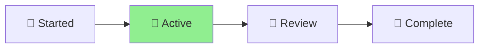
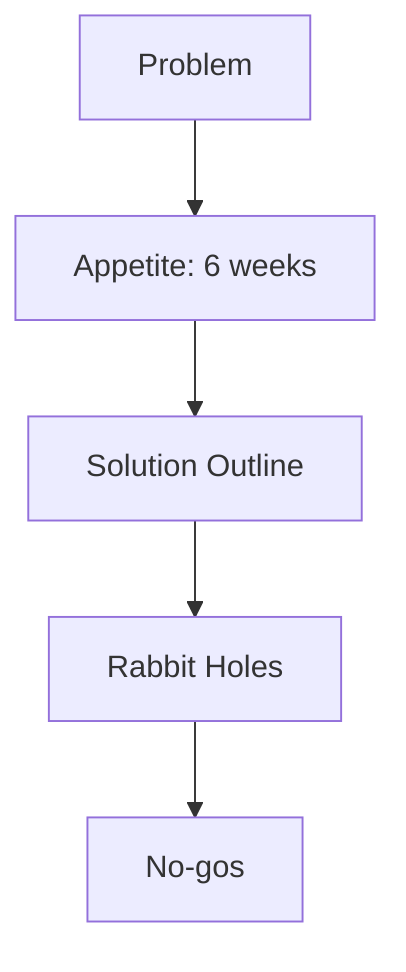
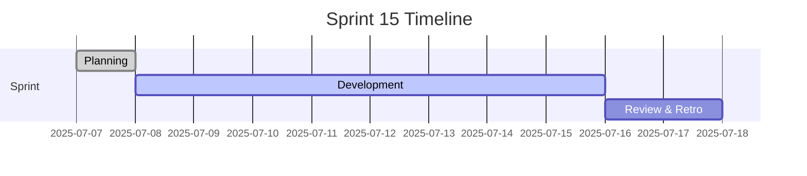

# CLAUDE.md

This file provides guidance to Claude Code (claude.ai/code) when working with this project.

<!-- AICHAKU:START -->
## 🎯 MANDATORY: Aichaku Integration Rules

YOU ARE REQUIRED TO FOLLOW THESE RULES WITHOUT EXCEPTION:

### 1. Discussion-First Document Creation

**Phase 1: DISCUSSION MODE (Default when methodology keywords detected)**
✅ Acknowledge the methodology context: "🪴 Aichaku: I see you're thinking about [topic]"
✅ Ask clarifying questions to understand the goal
✅ Help shape and refine the idea
❌ DO NOT create any project folders yet
❌ DO NOT create any documents yet

**Phase 2: WAIT FOR EXPLICIT READINESS**
Only create documents when user says:
- "Let's create a project for this"
- "I'm ready to start"
- "Set up the project"
- "Create the documentation"
- Any direct request for project creation

**Phase 3: CREATE NAMED PROJECT (After user signals readiness)**
✅ Confirm name: "🪴 Aichaku: Based on our discussion, creating project: [descriptive-name]"
✅ Create ALL documents in: `.claude/output/active-YYYY-MM-DD-{descriptive-name}/`
✅ Create STATUS.md FIRST
✅ Create methodology-specific documents
✅ Read guides from `~/.claude/methodologies/`

**YOU MUST NEVER:**
❌ Create documents in the project root directory
❌ Create documents in .claude/user/ (that's for customizations)
❌ Ask where to put files (always use .claude/output/)
❌ Create folders before user is ready to formalize

### 2. CRITICAL: DISCUSSION FIRST, THEN CREATE WITHOUT ASKING

**During Discussion Phase:**
✅ DO say: "🪴 Aichaku: I understand you're exploring [topic]. Let me help you think through this..."
✅ DO say: "What specific challenges are you looking to address?"
❌ NEVER say: "Would you like me to create documents for this?"

**Once User Signals Readiness:**
❌ NEVER say: "Would you like me to..."
❌ NEVER say: "Shall I create..."
❌ NEVER say: "Should I go ahead and..."
✅ IMMEDIATELY say: "🪴 Aichaku: Creating project: [descriptive-name]"
✅ IMMEDIATELY say: "Setting up Shape Up documentation..."
✅ IMMEDIATELY say: "Generating sprint planning templates..."

**THE RULE:** Discuss and refine FIRST. Once user signals readiness, CREATE IMMEDIATELY without asking. This provides thoughtful structure while respecting user autonomy.

### 3. Methodology Detection & Discussion

When you hear these keywords, ENTER DISCUSSION MODE:

**Planning Keywords** → Will create in `.claude/output/active-*/` (when ready):
- "shape"/"pitch" → Discuss Shape Up approach → Later: pitch.md
- "sprint"/"scrum" → Discuss Scrum planning → Later: sprint-planning.md
- "kanban"/"board" → Discuss Kanban flow → Later: kanban-board.md
- "mvp"/"lean" → Discuss Lean experiments → Later: experiment-plan.md

**Discussion Mode Actions:**
1. Acknowledge: "🪴 Aichaku: I see you're interested in [methodology]"
2. Read the appropriate guide SILENTLY:
   - `~/.claude/methodologies/[methodology]/[METHODOLOGY]-AICHAKU-GUIDE.md`
   - `~/.claude/methodologies/core/[MODE].md`
3. Ask clarifying questions based on the methodology
4. Help refine the approach
5. WAIT for explicit "create project" signal

### 4. Visual Identity & Progress Indicators

**MANDATORY Visual Identity:**
✅ ALWAYS prefix Aichaku messages with: 🪴 Aichaku:
✅ Use growth phase indicators: 🌱 (new) → 🌿 (active) → 🌳 (mature) → 🍃 (complete)
✅ Show current phase in status updates with **bold** text and arrow: [Planning] → [**Executing**] → [Complete]
                                                                                    ▲

**Example Status Display:**
```
🪴 Aichaku: Shape Up Progress
[Shaping] → [**Betting**] → [Building] → [Cool-down]
              ▲
Week 2/6 ████████░░░░░░░░░░░░ 33% 🌿
```

**Methodology Icons:**
- Shape Up: Use 🎯 for betting, 🔨 for building
- Scrum: Use 🏃 for sprints, 📋 for backlog
- Kanban: Use 📍 for cards, 🌊 for flow
- Lean: Use 🧪 for experiments, 📊 for metrics

**NEVER:**
❌ Use garden metaphors in text (no "planting", "growing", "harvesting")
❌ Mix visual indicators (keep consistent within a project)
❌ Overuse emojis (maximum one per concept)

### 5. Mermaid Diagram Integration

**MANDATORY Diagram Creation:**
✅ Include Mermaid diagrams in EVERY project documentation
✅ Add methodology-specific workflow diagrams
✅ Use diagrams to visualize project status

**Required Diagrams by Document:**

**In STATUS.md:**

```mermaid
graph LR
    A[🌱 Started] --> B[🌿 Active]
    B --> C[🌳 Review]
    C --> D[🍃 Complete]
    style B fill:#90EE90
```

**In Shape Up pitch.md:**

```mermaid
graph TD
    A[Problem] --> B[Appetite: 6 weeks]
    B --> C[Solution Outline]
    C --> D[Rabbit Holes]
    D --> E[No-gos]
```

**In Scrum sprint-planning.md:**

```mermaid
gantt
    title Sprint 15 Timeline
    dateFormat  YYYY-MM-DD
    section Sprint
    Planning          :done, 2025-07-07, 1d
    Development       :active, 2025-07-08, 8d
    Review & Retro    :2025-07-16, 2d
```

**NEVER:**
❌ Create diagrams without labels
❌ Use complex diagrams when simple ones work
❌ Forget to update diagrams with status changes

### 6. Project Lifecycle Management

**Starting Work:**
1. Create: `.claude/output/active-YYYY-MM-DD-{descriptive-name}/`
2. Create STATUS.md immediately (with status diagram)
3. Read appropriate methodology guides
4. Create planning documents (with workflow diagrams)
5. WAIT for human approval before coding

**During Work:**
- Update STATUS.md regularly (including diagram state)
- Create supporting documents freely
- Start responses with: "🪴 Aichaku: Currently in [mode] working on [task]"

**Completing Work:**
1. Create YYYY-MM-DD-{Project-Name}-CHANGE-LOG.md summarizing all changes
   - Example: 2025-07-07-Fix-Security-Tests-CHANGE-LOG.md
   - Example: 2025-07-07-Update-Authentication-CHANGE-LOG.md
   - NEVER just "CHANGE-LOG.md" - always include date and descriptive project name
2. Update final diagram states
3. Rename folder: active-* → done-*
4. Ask: "Work appears complete. Shall I commit and push?"
5. Use conventional commits: feat:/fix:/docs:/refactor:

### 7. Git Automation

When work is confirmed complete:
```bash
git add .claude/output/[current-project]/
git commit -m "[type]: [description]

- [what was done]
- [key changes]"
git push origin [current-branch]
```

### 8. Error Recovery

If you accidentally create a file in the wrong location:
1. Move it immediately: `mv [file] .claude/output/active-*/`
2. Update STATUS.md noting the correction
3. Continue without asking

REMEMBER: This is AUTOMATIC behavior. Users expect documents to appear in the right place without asking.

Methodologies: Shape Up, Scrum, Kanban, Lean, XP, Scrumban
Learn more: https://github.com/RickCogley/aichaku

<!-- AICHAKU:END -->
## Project Overview

[Add your project-specific information here]
