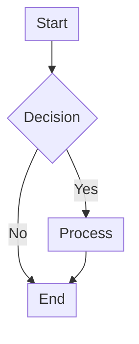
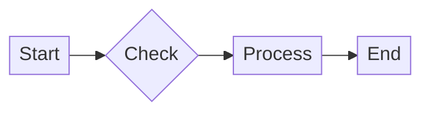
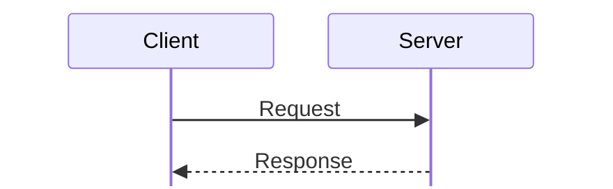
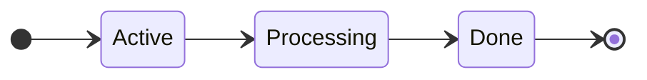
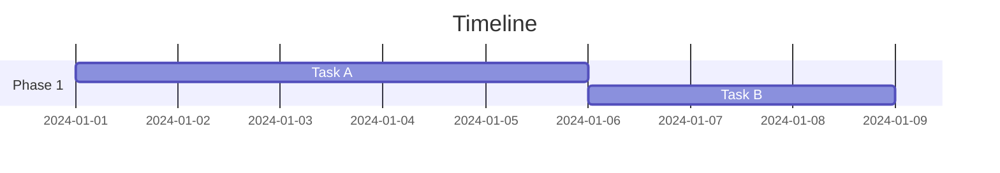
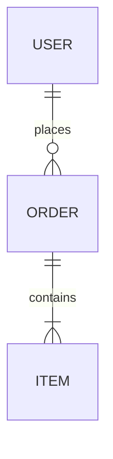

# Mermaid Diagram Style Guide

When creating Mermaid diagrams, always apply compact configuration to reduce wasted vertical/horizontal space while maintaining readability.

## Core Principles

1. **Always include init config** - Never create a Mermaid diagram without `%%{init: {...}}%%`
2. **Prefer horizontal layouts** - Use `LR` (left-right) when diagram has linear flow
3. **Use compact spacing values** - See templates below
4. **Short labels** - Keep node/actor labels concise; use aliases for longer names
5. **Parallel nodes** - Use `&` syntax to place nodes on same rank: `A --> B & C & D --> E`

## Default Templates (Copy-Paste Ready)

### Flowchart (Compact)



### Flowchart (Ultra-Compact, Horizontal)



### Sequence Diagram (Compact)



### State Diagram (Compact)



### Gantt Chart (Compact)



### Entity Relationship (Compact)



## Spacing Reference

### Flowcharts

| Property      | Default | Compact | Ultra-compact |
| ------------- | ------- | ------- | ------------- |
| `nodeSpacing` | 50      | 25–30   | 15–20         |
| `rankSpacing` | 50      | 35–40   | 25–30         |
| `padding`     | 8       | 6       | 4             |

### Sequence Diagrams

| Property        | Default | Compact | Effect                         |
| --------------- | ------- | ------- | ------------------------------ |
| `messageMargin` | 35      | 15–20   | Vertical gap between messages  |
| `boxMargin`     | 10      | 4–6     | Margin around activation boxes |
| `actorMargin`   | 50      | 30–40   | Horizontal actor spacing       |
| `mirrorActors`  | true    | false   | Removes bottom actor row       |
| `height`        | 65      | 40–50   | Actor box height               |

### Gantt Charts

| Property      | Default | Compact | Effect              |
| ------------- | ------- | ------- | ------------------- |
| `barHeight`   | 20      | 12–15   | Height of task bars |
| `barGap`      | 4       | 2–3     | Gap between bars    |
| `leftPadding` | 75      | 50–60   | Label area width    |

## Structural Techniques

**Parallel nodes (same rank):**

```
A --> B & C & D --> E
```

**Invisible links for alignment:**

```
A ~~~ B
```

**Collapsed subgraphs:**

```
subgraph S1[" "]
    direction LR
    A --- B --- C
end
```

**Shorter participant aliases:**

```
participant C as Client
participant S as Server
```

**Horizontal layout inside subgraphs:**

```
subgraph Group
    direction LR
    P1 --- P2 --- P3
end
```

Use `---` (no arrow) for horizontal chains, `~~~` for invisible vertical alignment.

**Avoid subgraph title overlap:**

- Single-node subgraphs: combine title into node text instead
- Multi-node subgraphs: use short titles with low padding
- Empty title trick: `subgraph S1[" "]` hides the title

## Troubleshooting

| Problem            | Solution                                        |
| ------------------ | ----------------------------------------------- |
| Diagram too tall   | Switch `TD` to `LR`, use `&` for parallel nodes |
| Text cut off       | Increase `padding` slightly                     |
| Arrows overlapping | Increase `nodeSpacing`, use `curve: 'basis'`    |
| Need more width    | Use `direction LR` inside subgraphs             |

## Platform Compatibility

| Platform              | Full Config Support |
| --------------------- | ------------------- |
| GitHub/GitLab         | ✓                   |
| Obsidian              | ✓                   |
| VS Code (Mermaid ext) | ✓                   |
| Typora                | ✓                   |
| Notion                | Partial             |
| Confluence            | Limited             |
