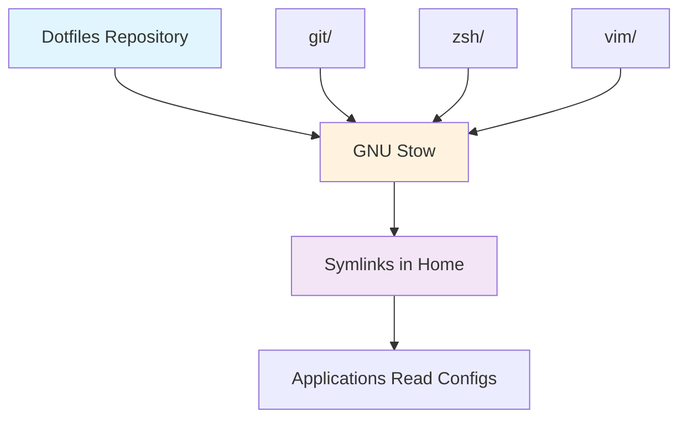

# Understanding dotfiles architecture

## Overview

This dotfiles repository implements a modular, maintainable system for
managing configuration files across macOS development environments. The
architecture prioritizes security, flexibility, and ease of use through
established Unix patterns and modern tooling.

## Context

Developers accumulate numerous configuration files (dotfiles) that customize
their development environment. Managing these files across multiple machines,
keeping them synchronized, and sharing them with team members presents
significant challenges. This architecture addresses these challenges through
a systematic approach to dotfile organization and deployment.

## Background

Traditional dotfile management involves manually copying configuration files
between systems, leading to inconsistencies and lost customizations. Common
problems include:

- Configuration drift between machines
- Lost customizations after system reinstalls  
- Difficulty sharing configurations with team members
- Accidental exposure of sensitive information
- No version history or rollback capability

## How the architecture works

The system uses a three-layer approach:



### Layer 1: Repository structure

Each application's configuration lives in its own directory, mirroring the
structure it expects in the home directory:

```
~/.dotfiles/
├── git/
│   ├── .gitconfig              # → ~/.gitconfig
│   └── .config/
│       └── git/
│           └── ignore          # → ~/.config/git/ignore
├── zsh/
│   ├── .zshrc                  # → ~/.zshrc
│   ├── .zshenv                 # → ~/.zshenv
│   └── .config/
│       └── zsh/
│           └── functions/      # → ~/.config/zsh/functions/
└── vim/
    └── .vimrc                  # → ~/.vimrc
```

### Layer 2: GNU Stow management

GNU Stow creates and manages symlinks from the repository to your home
directory. When you run `stow git`, it:

1. Reads the `git/` directory structure
2. Creates parent directories as needed
3. Symlinks each file to the corresponding location in `$HOME`
4. Detects and reports conflicts

### Layer 3: Application integration

Applications read their configuration from standard locations in your home
directory, unaware they're reading symlinked files. This transparency ensures
compatibility with all tools.

## Design decisions

### Why GNU Stow

We chose GNU Stow over alternatives for several reasons:

**Advantages:**
- Predictable, consistent behavior.
- No configuration required.
- Handles directory creation automatically.
- Conflict resolution built-in.
- Widespread availability.

**Trade-offs:**
- Requires manual `stow` commands.
- No built-in templating.
- Limited to symlink management.

### Directory organization

The flat, application-based structure was chosen for clarity:

```
dotfiles/
├── app1/           # All app1 configs
├── app2/           # All app2 configs
└── shared/         # Shared configurations
```

This structure beats alternatives like organizing by file type or machine
because:
- Clear visibility of all configs for one application.
- Straightforward addition/removal of entire applications.
- Clear ownership of each file.

### Security considerations

The architecture addresses security through:

1. **No secrets in repository**
   - GPG keys, SSH keys, and tokens stay out.
   - Use `.gitignore` patterns aggressively.
   - Reference external secret stores.
   - Split configuration pattern for sensitive values.

2. **Split configuration pattern**
   - Public configs tracked in repository.
   - Private configs via `.local` files (gitignored).
   - Templates show structure without exposing secrets.
   - Git's `[include]` directive merges configurations.

3. **Minimal permissions**
   - Symlinks preserve original file permissions.
   - No need for elevated privileges.
   - User owns all configuration.

4. **Audit trail**
   - Git history shows all changes.
   - Review modifications with standard git tools.
   - Rollback problematic changes when needed.

## Common patterns

### Pattern 1: Modular activation

Apply configurations selectively based on machine role:

```bash
# Development machine
stow git zsh vim homebrew

# Server
stow git zsh tmux

# Minimal setup
stow git
```

### Pattern 2: Machine-specific overrides

Handle machine-specific settings through:

1. **Conditional includes in configs:**
   ```gitconfig
   [includeIf "gitdir:~/work/"]
       path = ~/.config/git/work.config
   ```

2. **Environment detection in shell:**
   ```bash
   if [[ "$(hostname)" == "work-laptop" ]]; then
       source ~/.config/zsh/work.zsh
   fi
   ```

### Pattern 3: Dependency management

Document and automate dependency installation:

```bash
# homebrew/Brewfile
brew "stow"
brew "git"
brew "zsh"
cask "visual-studio-code"
```

## Discussion

### Comparison with alternatives

| Approach | Pros | Cons | Best for |
|----------|------|------|----------|
| **GNU Stow** (our choice) | Reliable, no dependencies | Manual management, no templating | General use, simplicity |
| **Bare Git Repo** | No symlinks, direct tracking | Complex setup, error-prone | Advanced users |
| **Dotfile Managers** | Features like templating, auto-sync | Additional dependency, complexity | Large deployments |
| **Manual Copying** | No tools needed | Error-prone, no history | One-off setups |

### Implementation details

#### Stow internals

GNU Stow uses a "folding" algorithm:
1. If target doesn't exist → create symlink.
2. If target is symlink to stow → update if needed.
3. If target is directory → fold (recurse) into it.
4. If target is file → conflict error.

#### Conflict resolution

When conflicts occur:
```bash
# See what would happen
stow -n -v git

# Force overwrite (careful!)
stow --adopt git

# Manual resolution
mv ~/.gitconfig ~/.gitconfig.backup
stow git
```

#### Performance considerations

- Symlinks have negligible performance impact.
- Git operations on large histories can be slow.
- Consider shallow clones for quick setup.
- `.gitignore` patterns affect repository speed.

### Further reading

- [GNU Stow Manual](https://www.gnu.org/software/stow/manual/)
- [XDG Base Directory Specification](https://specifications.freedesktop.org/basedir-spec/basedir-spec-latest.html)
- [Git Configuration Documentation](https://git-scm.com/docs/git-config)
- [Zsh Startup Files](http://zsh.sourceforge.net/Intro/intro_3.html)

## Summary

This architecture provides:
- **Modularity** through application-based organization.
- **Reliability** through GNU Stow's symlink management.
- **Security** through careful secret handling.
- **Maintainability** through version control and clear structure.

The design trades some automation features for simplicity and predictability,
making it suitable for developers who value understanding and controlling
their environment.