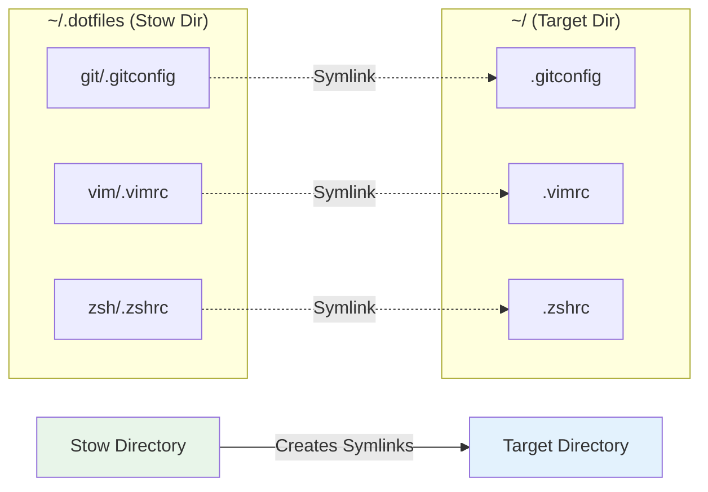

# Why GNU Stow for dotfile management

## Overview

GNU Stow is a symlink farm manager originally designed for managing software
installations in `/usr/local`. Its elegant approach to directory tree
management makes it perfect for dotfile organization, providing a powerful
solution to a common developer problem.

## Background

Before diving into why Stow excels at dotfile management, understanding the
problem space is important. Developers accumulate configuration files
(dotfiles) that customize their tools - `.bashrc`, `.gitconfig`, `.vimrc`,
and many others. Managing these files across multiple machines, backing them
up, and sharing them becomes challenging without proper tooling.

## How GNU Stow works

Stow operates on a straightforward principle: it manages symlinks between a
"stow directory" (your dotfiles repository) and a "target directory"
(usually your home folder).



### The folding algorithm

Stow's intelligence lies in its "folding" algorithm:

1. **Empty Target**: Creates a symlink to the source directory
2. **Existing Symlink**: Updates if it points to stow, conflicts otherwise
3. **Real Directory**: "Folds" by descending into both directories
4. **Real File**: Reports a conflict

This algorithm allows Stow to intelligently merge directory trees while maintaining clear ownership of files.

## Design decisions

### Why we chose GNU Stow

After evaluating numerous dotfile management solutions, we selected GNU Stow for several compelling reasons:

**Advantages:**

1. **Simplicity**: No configuration files, no complex setup.
2. **Transparency**: Creates standard symlinks - no magic.
3. **Modularity**: Natural package-based organization.
4. **Conflict detection**: Prevents accidental overwrites.
5. **Reversibility**: Unstow and restore original state.
6. **Ubiquity**: Available in most package managers.
7. **Maturity**: Stable tool with decades of development.

**Trade-offs:**

1. **No templating**: Can't customize files per machine.
2. **Manual operations**: Requires explicit stow/unstow commands.
3. **Symlink limitations**: Some tools don't follow symlinks.
4. **No encryption**: Secrets need separate handling.

### Alternative approaches considered

| Solution | Pros | Cons | Why not chosen |
|----------|------|------|----------------|
| **Bare Git Repo** | No symlinks, direct tracking | Complex setup, error-prone commits | Too error-prone for team use |
| **Dotbot** | YAML configuration, plugins | Additional dependency, configuration complexity | Over-engineered for our needs |
| **Homesick** | Ruby-based, git integration | Ruby dependency, less flexible | Language-specific dependency |
| **Manual scripts** | Complete control | Maintenance burden, reinventing the wheel | Too much custom code |
| **rcm** | Thoughtbot's solution, tags | Less intuitive than stow | Stow's simplicity wins |

## Common patterns

### Pattern 1: Package organization

Stow encourages organizing dotfiles by application:

```
dotfiles/
├── git/
│   ├── .gitconfig
│   └── .gitignore_global
├── vim/
│   ├── .vimrc
│   └── .vim/
│       ├── colors/
│       └── plugins/
└── zsh/
    ├── .zshrc
    └── .zshenv
```

This mirrors how system packages are organized and makes selective installation trivial.

### Pattern 2: XDG base directory support

Modern applications follow the XDG specification:

```
dotfiles/
└── app/
    └── .config/
        └── app/
            ├── config.yml
            └── themes/
```

Stow handles nested directories elegantly, creating parent directories as needed.

### Pattern 3: Adoption workflow

When starting fresh with existing dotfiles:

```bash
# Move existing files into repo
mv ~/.gitconfig ~/.dotfiles/git/

# Create symlink
stow git

# Or adopt existing files
stow --adopt git  # Moves existing files into stow directory
```

## Comparison with alternatives

### Bare Git repository method

The bare git repo method tracks files directly:

```bash
git --git-dir=$HOME/.dotfiles --work-tree=$HOME add .bashrc
```

**Why Stow is better:**
- Clear separation between tracked and untracked files.
- No risk of accidentally committing sensitive files.
- Easier to understand what's managed.
- Natural package organization.

### Dedicated dotfile managers

Tools like `chezmoi`, `dotbot`, or `yadm` offer features like:
- Templating
- Encryption
- Auto-commit
- Machine-specific configs

**Why Stow is better (for our use case):**
- Zero configuration required.
- No abstraction layer to learn.
- Standard Unix tools (just symlinks).
- Debug issues when things go wrong.
- No vendor lock-in.

### Manual symlink scripts

Many developers write custom scripts:

```bash
ln -sf $DOTFILES/vimrc ~/.vimrc
ln -sf $DOTFILES/bashrc ~/.bashrc
```

**Why Stow is better:**
- Handles directory creation.
- Conflict detection.
- Rollback support.
- Maintains symlink farm consistency.
- Battle-tested edge case handling.

## Technical deep dive

### Stow's tree folding

When Stow encounters directories, it "folds" them:

```
Initial state:
~/.config/
└── existing-app/
    └── settings.ini

Stow package:
myapp/
└── .config/
    └── myapp/
        └── config.ini

After stowing:
~/.config/
├── existing-app/
│   └── settings.ini
└── myapp -> ~/.dotfiles/myapp/.config/myapp
```

This intelligence prevents unnecessary directory symlinks while maintaining organization.

### Conflict resolution

Stow's conflict handling ensures safety:

```bash
$ stow vim
WARNING! stowing vim would cause conflicts:
  * existing target is neither a link nor a directory: .vimrc
All operations aborted.
```

Resolution strategies:
1. **Backup and remove**: `mv ~/.vimrc ~/.vimrc.bak && stow vim`
2. **Adopt existing**: `stow --adopt vim`
3. **Force (dangerous)**: `stow --override=.* vim`

### Performance characteristics

- **Symlink overhead**: Negligible (one extra inode lookup).
- **Stow operation speed**: O(n) where n is number of files.
- **Memory usage**: Minimal, processes one file at a time.
- **Disk usage**: Only inodes for symlinks.

## Security considerations

### Advantages
1. **Clear boundaries**: Obvious what's version controlled.
2. **No execution**: Stow just creates symlinks.
3. **Permission preservation**: Symlinks don't change file permissions.
4. **Audit trail**: Git history shows all changes.

### Challenges
1. **Symlink attacks**: Mitigated by user-only operations.
2. **Secret management**: Must handle separately from Stow.
3. **Public repos**: Risk of accidentally committing secrets.

### Best practices
- Never stow directories containing secrets.
- Use `.gitignore` aggressively.
- Regular security audits of public repos.
- Consider private repos for sensitive configs.

## Real-world benefits

### Development workflow
1. **New machine setup**: Clone and stow - minutes not hours.
2. **Experimentation**: Unstow to test vanilla configs.
3. **Sharing**: Colleagues can selective adopt your tools.
4. **Backup**: Natural version control through Git.

### Team collaboration
- Shared configurations with personal overrides.
- Onboarding with selective adoption.
- No forced tool choices.
- Learn from others' setups.

## Conclusion

GNU Stow strikes the perfect balance between simplicity and functionality for
dotfile management. While it lacks advanced features like templating or
encryption, its Unix philosophy approach - do one thing well - makes it an
ideal choice for developers who value:

- **Simplicity** over feature richness.
- **Transparency** over abstraction.
- **Stability** over innovation.
- **Standards** over proprietary solutions.

For teams and individuals managing dotfiles, Stow provides a robust,
understandable, and maintainable solution that stands the test of time.