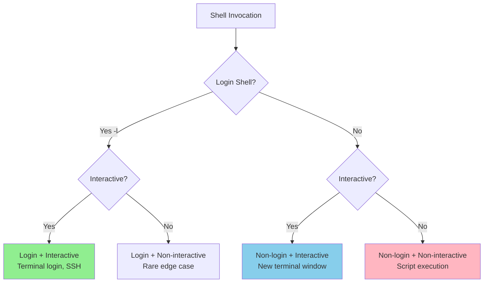
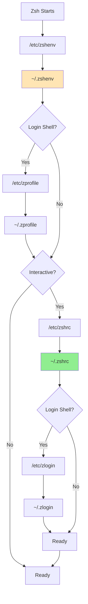

# Shell startup sequence explained

## Overview

Understanding the shell startup sequence is crucial for effective dotfile
management. This document explains how Zsh (and other shells) load
configuration files, when each file is sourced, and how to optimize your
setup for performance and functionality.

## Context

Unix shells have evolved complex initialization sequences to handle different
use cases: login shells, interactive shells, non-interactive shells, and
shell scripts. Each type requires different configurations, leading to
multiple initialization files with specific purposes. This complexity often
confuses developers, resulting in misconfigured environments or performance
issues.

## Background

The shell startup sequence evolved from the original Bourne shell's simple
`.profile` file to today's multi-file systems. This evolution addressed
several needs:

- Separating environment variables from interactive features
- Supporting both system-wide and user-specific configurations
- Optimizing performance for non-interactive scripts
- Maintaining backward compatibility with existing systems

## How shell startup works

### Shell types

Before diving into the startup sequence, understanding shell types is
essential:



### Zsh startup sequence

The complete Zsh startup sequence:



### File purposes

Each configuration file serves a specific purpose:

| File | When Loaded | Purpose | Example Content |
|------|-------------|---------|-----------------|
| **~/.zshenv** | Always | Environment variables | PATH, EDITOR, LANG |
| **~/.zprofile** | Login shells | Login-time setup | Large initializations |
| **~/.zshrc** | Interactive shells | Aliases, prompts, functions | Most configurations |
| **~/.zlogin** | After zshrc (login) | Post-setup tasks | Message of the day |
| **~/.zlogout** | Login shell exit | Cleanup tasks | Clear screen, temp cleanup |

## Design decisions

### Why this complexity exists

The multi-file system evolved to handle different scenarios efficiently:

1. **Performance**: Scripts don't load interactive features
2. **Flexibility**: Different configs for different contexts
3. **Compatibility**: Match traditional shell behavior
4. **Hierarchy**: System-wide vs user-specific settings

### Modern best practices

Most modern setups concentrate configuration in fewer files:

```zsh
# ~/.zshenv - Minimal, just critical environment
export ZDOTDIR="$HOME/.config/zsh"
export PATH="$HOME/bin:$PATH"

# ~/.zshrc - Everything else
# Aliases, functions, completions, prompt, etc.
```

## Common patterns

### Pattern 1: Login detection

Detect if running in a login shell:

```zsh
# In .zshrc
if [[ -o login ]]; then
    echo "Welcome, $USER!"
    # Login-specific tasks
fi
```

### Pattern 2: Interactive detection

Only load interactive features when needed:

```zsh
# In .zshrc
if [[ $- == *i* ]]; then
    # Interactive-only configurations
    alias ll='ls -la'
    bindkey '^R' history-incremental-search-backward
fi
```

### Pattern 3: Performance profiling

Debug slow startup:

```zsh
# Add to start of .zshrc
zmodload zsh/zprof

# Add to end of .zshrc
zprof  # Shows time spent in each function
```

### Pattern 4: Conditional loading

Load configurations based on availability:

```zsh
# Load tool if available
if command -v starship >/dev/null 2>&1; then
    eval "$(starship init zsh)"
fi

# Source file if exists
[[ -f ~/.aliases ]] && source ~/.aliases
```

## Discussion

### Comparison with other shells

#### Bash startup sequence

```mermaid
graph TD
    A[Bash Starts] --> B{Login Shell?}
    B -->|Yes| C["/etc/profile"]
    C --> D["~/.bash_profile"<br/>OR ~/.bash_login<br/>OR ~/.profile"]
    D --> E{Interactive?}
    
    B -->|No| F{Interactive?}
    
    E -->|Yes| G["~/.bashrc"]
    F -->|Yes| G
    
    E -->|No| H[Ready]
    F -->|No| H
    G --> H
```

Key differences from Zsh:
- No equivalent to `zshenv` (always-loaded file)
- `~/.bashrc` not automatically loaded for login shells
- Common pattern: source `.bashrc` from `.bash_profile`

#### Fish shell startup

Fish uses a more straightforward model:

```
~/.config/fish/config.fish    # Always for interactive
~/.config/fish/functions/     # Autoloaded functions
~/.config/fish/conf.d/        # Autoloaded configs
```

### Performance optimization

#### Lazy loading

Defer expensive operations:

```zsh
# Instead of immediate execution
eval "$(rbenv init -)"

# Use lazy loading
rbenv() {
    eval "$(command rbenv init -)"
    rbenv "$@"
}
```

#### Conditional sourcing

Skip unnecessary loads:

```zsh
# Only load work config at work
if [[ "$(hostname)" == *"work"* ]]; then
    source ~/.config/zsh/work.zsh
fi
```

#### Compilation

Compile scripts for faster loading:

```zsh
# Compile .zshrc if newer than compiled version
if [[ ~/.zshrc -nt ~/.zshrc.zwc ]]; then
    zcompile ~/.zshrc
fi
```

#### Benchmarking

Measure startup time:

```zsh
# Time shell startup
time zsh -i -c exit

# Detailed profiling
zsh -xvl 2>&1 | ts -i "%.s" > startup.log
```

### Troubleshooting

#### Common issues

**Problem**: Commands not found in scripts  
**Cause**: PATH only set in `.zshrc`  
**Solution**: Move PATH to `.zshenv`

**Problem**: Aliases not working in vim  
**Cause**: Vim spawns non-interactive shell  
**Solution**: Use functions or scripts instead

**Problem**: Slow terminal startup  
**Cause**: Heavy operations in `.zshrc`  
**Solution**: Profile and optimize, use lazy loading

**Problem**: Different behavior SSH vs local  
**Cause**: SSH creates login shell  
**Solution**: Ensure consistent configs across files

#### Debug techniques

1. **Trace execution**:
   ```zsh
   zsh -x  # Print commands as executed
   ```

2. **Check shell type**:
   ```zsh
   [[ -o login ]] && echo "Login shell"
   [[ -o interactive ]] && echo "Interactive shell"
   ```

3. **Source order**:
   ```zsh
   # Add to each file
   echo "Loading $(basename $0)"
   ```

### Best practices

#### File organization

1. **`.zshenv`**: Minimal, only essential environment
2. **`.zprofile`**: Rarely used in modern setups
3. **`.zshrc`**: Main configuration file
4. **`.zlogin`**: Avoid, use `.zprofile` if needed
5. **Modular configs**: Source from `.zshrc`:
   ```zsh
   for config in ~/.config/zsh/*.zsh; do
       source "$config"
   done
   ```

#### Security considerations

1. **Don't leak sensitive data**:
   ```zsh
   # Bad: Visible in process list
   export API_KEY="secret"
   
   # Better: Read from file
   export API_KEY=$(cat ~/.secrets/api_key)
   ```

2. **Validate sourced files**:
   ```zsh
   # Check ownership before sourcing
   if [[ -O "$config_file" ]]; then
       source "$config_file"
   fi
   ```

3. **Be careful with PATH**:
   ```zsh
   # Prepend, don't replace
   export PATH="$HOME/bin:$PATH"
   # Not: export PATH="$HOME/bin"
   ```

### Advanced topics

#### Custom ZDOTDIR

Organize configs outside HOME:

```zsh
# In ~/.zshenv
export ZDOTDIR="$HOME/.config/zsh"

# Now Zsh looks for:
# $ZDOTDIR/.zshrc instead of ~/.zshrc
```

#### Emulate other shells

For compatibility:

```zsh
# Emulate sh for POSIX scripts
emulate sh -c 'source script.sh'

# Emulate bash for bash scripts
emulate bash -c 'source script.bash'
```

#### System-wide configuration

For multi-user systems:

```
/etc/zshenv     # Global environment
/etc/zprofile   # Global login setup
/etc/zshrc      # Global interactive
/etc/zlogin     # Global login finish
/etc/zlogout    # Global logout
```

## Summary

Understanding shell startup sequences enables:
- **Faster shell startup** through proper file usage
- **Correct behavior** across different invocation types
- **Better debugging** when things go wrong
- **Cleaner organization** of configurations

The key is putting the right configuration in the right file:
- Environment variables → `.zshenv`
- Interactive features → `.zshrc`
- Login messages → `.zprofile` or `.zlogin`
- Keep it minimal and profile regularly!